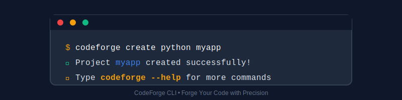

<!-- file: README.md -->

<p align="center">
  
</p>

<h1 align="center">CodeForge 🔨</h1>
<h3 align="center">منشئ المشاريع البرمجية</h3>

<p align="center">
  
  
  
  
</p>

<p align="center">
  
</p>

<div align="center">

```bash
# إنشاء مشروع جديد
python cli_main.py create python_basic myapp --author "اسمك"
</div>
✨ المميزات
الميزة	الوصف
🚀 إنشاء سريع	أنشئ مشاريع Python جاهزة في ثوانٍ
🎨 هوية بصرية	شعار وألوان مميزة
⚡ CLI سلس	واجهة سطر أوامر سهلة الاستخدام
🔧 قابل للتوسع	مصمم لينمو مع مشاريعك
🎨 الهوية البصرية
<p align="center">   </p>
نظام الألوان
css
الأزرق الأساسي (#2563eb): الثقة والاحترافية
البرتقالي الثانوي (#f59e0b): الإبداع والطاقة
الرمادي الداكن (#1e293b): البساطة والوضوح
📦 التثبيت
bash
# 1. استنسخ المشروع
git clone https://github.com/Abdullahreda1969/codeforge.git
cd codeforge

# 2. إنشاء بيئة افتراضية (اختياري)
python -m venv venv
# على Windows:
.\venv\Scripts\activate
# على Mac/Linux:
source venv/bin/activate

# 3. تثبيت المكتبات
pip install -r requirements.txt
🛠️ الاستخدام
عرض الإصدار
bash
python cli_main.py version
عرض القوالب المتاحة
bash
python cli_main.py list-templates
إنشاء مشروع جديد
bash
python cli_main.py create python_basic مشروعي --author "اسمك" --year "2024"
الحصول على المساعدة
bash
python cli_main.py --help
🏗️ الهيكل
text
codeforge/
├── src/codeforge/           # الحزمة الرئيسية
├── branding/               # الهوية البصرية
├── cli_main.py            # نقطة الدخول
├── pyproject.toml         # إعدادات المشروع
└── requirements.txt       # التبعيات
🤝 المساهمة
Fork المشروع

أنشئ فرعاً للميزة الجديدة (git checkout -b feature/amazing)

أضف تغييراتك (git commit -m 'Add amazing feature')

ادفع للفرع (git push origin feature/amazing)

أنشئ Pull Request

📄 الرخصة
هذا المشروع مرخص تحت رخصة MIT.

<p align="center"> صنع بـ ❤️ باستخدام <strong>CodeForge</strong> </p> ```